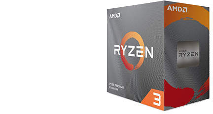
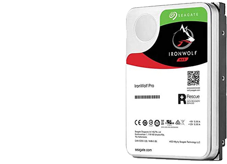
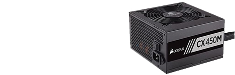

1. [Full Part List](part-list.md "Full Part List")
1. [Full Specifications](specs.md "Full Specifications")
1. [Full Dimensions, CAD Files, and Drawings](dimensions.md "Dimensions, 3D models, etc.")
1. [Backup Server](backup-server.md "Backup Server")
5. [Tips and Tricks to Save Time When Setting Up](save-time.md "Time-Saving Tips and Tricks")
6. [Additional Recommended Software Tweaks](tweaks.md "Additional Software Tweaks")
---

 In order to have a redundant system and to cause as few headaches as possible, you will need to have a way to back up the Compute Modules' MicroSD cards or eMMC memory. It is important that you have enough storage for at least 1 backup of each device at any given time. For the master, it might be helpful to have more than one. For this reason, below is a part list of a backup server PC with enough storage to keep you going for a while.

**Backup Server Part List:**

* CPU: Something budget-end like the [**AMD Ryzen 3 3100**](https://www.amazon.com/AMD-8-Thread-Unlocked-Desktop-Processor/dp/B0876Y2TMZ) *OR* the Intel equivalent of the [**Intel Core i5-10400**](https://www.amazon.com/Intel-i5-10400-Desktop-Processor-LGA1200/dp/B086MN38Q2/ref=sr_1_2?dchild=1&keywords=i5+10400&qid=1590334730&s=electronics&sr=1-2). You don't need a lot of horsepower for a backup server, unless you're transferring a lot of data at once. If we were to do the backup over the ethernet network, the switching capacity inside of the network would be only 1 Gigabit per second to each device, so the backup server will be connected to the cluster at only 125 MB/s, well below the capacity of these CPUs. I would personally go with the i5 10400 due to it having 2 more cores, with about the same turbo speed, and the cores per dollar is much better on the i5. It is going for 190 USD right now, while the R3 3100 is going for 140-150 USD, which is hard to pass up, not to mention that the i5 has integrated graphics, so we don't need a discrete GPU, which will cost at least 50 more dollars. I KNOW, I KNOW. You think I am in a world of hate, but look at the facts. Team Red is not that viable in this scenario. I'll update this page as more information comes out or prices change. Cores with decent clock speed is very important for compression, which will be utilized to make the backups smaller in size.

 

* RAM: **16 GB** of **DDR4-3200** or faster RAM. For Ryzen, this is especially critical to get the most performance. AMD Ryzen processors are highly influenced by RAM speed, Intel processors, not so much. You will want 16GB because the Operating System can eat up RAM like crazy.

* Storage: Here is where things get interesting. It is highly recommended that you use an SSD for a boot drive, so it takes seconds, instead of minutes for the server to turn on. Depending on what motherboard you get, you way want to get a different SSD. For the Ryzen owners out there with a new enough CPU, **PCIe Gen 4 NVMe SSDs** will be highly recommended. They can achieve higher IOPS and can achieve higher throughput at the same time. For the Intel owners, there is sadly no light on PCIe Gen 4 as of yet, so you may want to stick to a PCIe Gen 3 NVMe SSD, or a Gen 4, but with lower throughput. As for the bulk of the storage, I recommend going with 4 of Seagate's [**IronWolf Pro 16TB**](https://www.amazon.com/Seagate-IronWolf-16TB-SATA-256Mb/dp/B07SJTST6T/ref=sr_1_5?dchild=1&keywords=ironwolf+pro+16tb&qid=1590334768&s=electronics&sr=1-5) HDD in a Raid 0 configuration so you get 64 TB of raw storage. This will store all of your backups. This will allow the size of the backups to be just under 16GB for each of the nodes. I don't think this will be an issue due to compression of backups and the nodes not being full to the brim with files.

* Motherboard: I am going to leave this up to you to decide. However, I will give you some chipset recommendations. For AMD and the Ryzen 3 3100, go with a motherboard that has either the **B450/B550 chipset**. The VRM and power delivery are typically important to pay attention to, but since the CPU is only rated for 65W, don't fuss too much about that unless you're planning to upgrade. As for Intel and the i5 10400, go with a motherboard with the **H490 chipset**. These have not been released yet, but pay attention for when they arrive. No matter what CPU or motherboard you go with, *please check the reviews to make sure that it is a solid board.*

* GPU: **Important: The Intel i5 10400 doesn't need the GT710. It has its own iGPU.** Nothing too fancy is needed here. I recommend the GT710 chipset from Nvidia. This is just a reference chipset because the prices fluctuate from brand to brand. This GPU can be had for under 50 USD if you live in the states.

* CPU cooler: Both CPUs come with a stock cooler. This means that you don't need to buy a seperate one unless you're planning on doing extreme overclocking, which we're not, so no aftermarket cooler.

* Mouse/Keyboard: Get whatever floats your boat. You don't need anything super fancy, you just need something that works.

* Monitor: Same thing as the Mouse/Keyboard. You don't need anything fancy.

* Case: There are limitless possibilities here, but I recommended going with the [**NZXT H710**](https://www.amazon.com/NZXT-H710-Quick-Release-Water-Cooling-Construction/dp/B07T94WD22/ref=sr_1_1?dchild=1&keywords=nzxt+h710&qid=1590334833&s=electronics&sr=1-1) or similar. It has space for four HDDs, which we will need, and fits just about everything else.

* Power Supply: You don't need a lot of wattage in this build. I recommend going with the [**Corsair CX450M**](https://www.newegg.com/corsair-cx-series-cx450m-450w/p/N82E16817139146) or similar. It has the 4 SATA connectors that we need, and enough wattage to drive the system.

