1. [Full Part List](part-list.md "Full Part List")
1. [Full Specifications](specs.md "Full Specifications")
1. [Full Dimensions, CAD Files, and Drawings](dimensions.md "Dimensions, 3D models, etc.")
1. [Backup Server](backup-server.md "Backup Server")
5. [Tips and Tricks to Save Time When Setting Up](save-time.md "Time-Saving Tips and Tricks")
6. [Additional Recommended Software Tweaks](tweaks.md "Additional Software Tweaks")
---

1. **Rasberry Pi Compute Module 3+ Lite** | There is no surprise that you need this. This is the brain of the cluster and without it, you can't really do anything. All the computing from the *Blender* renders, the *XMRig* hashes, and the simulation frames is all done on the CM3+. It really depends on how many you need, but since we can have as many as we want in theory, I'll say 4032 just to up the ante. Again, you may need more or less depending on your application. I would guess less. How much it will cost varies. The MSRP for the Lite version (No eMMC storage) is 25 USD. However, if you get it from [here](https://www.newark.com/raspberry-pi/cm3-lite/raspberry-pi-compute-module-3/dp/94AC6633), it will only cost 23.75 USD which totals out to 95760 USD excl. Sales Tax. So...we'll say 100K USD or there about.

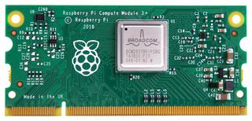

2. Next up, the **Turing Pi**. This is the heart of the computer. It manages all the Raspberry Pi Compute Modules. It makes sure that they are running properly. It's like an interconnect of sorts for 7 computers. They cost roughly 190 USD each and we will need 576, so that comes out to 109,440 USD total excl. Sales Tax. That's more than the Compute Modules which, in my opinion, is ridiculous. Maybe if you talk to customer support, you could get the price down some. Don't take this for granted, though. This product has not been released yet, but it is very close. Some content creators have gotten development versions and they work very well. You can find the Turing Pi [here](https://turingpi.com/).

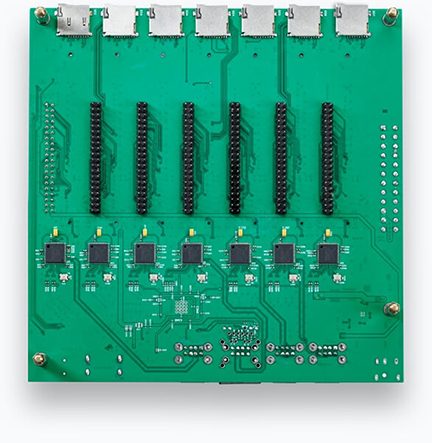

3. This next product is very important for the time saving aspect when building. It is called the **BalenaEtcher Pro**. It is basically the hardware product of the software BalenaEtcher. You can flash lots of MicroSD cards at once (up to 160)! This can be achieved by daisy chaining 10 BalenaEtcher  Pros together. Each Etcher Pro has 16 ports. This product has not been released yet, but it is planned. There is no price for it yet. It is, according to Balena.io, going through validation. You can sign up for updates on the product by going [here](https://www.balena.io/etcher/pro/).

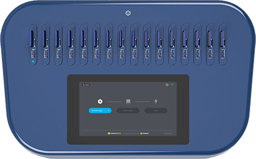

4. In order to connect to the network and to each other, you need no either use WiFi or Ethernet. With so many nodes online, WiFi can become crowded and lots of packets may be lost. For this reason, I'll use ethernet. This does decrease the density in terms of nodes per rack, but I think it's worth it. The main Ethernet switch that we will need is the **NETGEAR GS348T**. This is a 52-port network switch with 48 Gigabit RJ45 (Ethernet) ports and 4 Gigabit SFP ports. The SFP ports will not be used in this project. We will need 12 of these total, 6 in each 42U rack. This will cost 3085.56 USD excl. Sales Tax. It is currently 30% off, so it may go up in price. I'll update once the sale goes away. This switch can be bought [here](https://www.amazon.com/NETGEAR-52-Port-Gigabit-Ethernet-Managed/dp/B005EV1VIK/ref=dp_ob_title_ce?th=1).

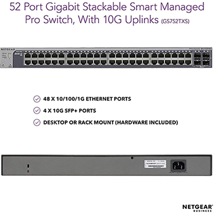

5. For those of you that saw the previous item that was here (the 8-port NETGEAR gigabit switch), this is not needed anymore. Instead, we will use **SFP to 1GBase-T adapters** from *10Gtek*. These will take the SFP ports on each of the gigabit switches and then adapt them to gigabit ethernet. We will need 12 of these. They cost 21.99 USD each, which totals out to 263.88 USD. They are on the expensive side. If you can find cheaper ones at the same or better quality level, be sure to let me know through an issue post on this repo. You can check them out [here](https://www.amazon.com/10Gtek-Compatible-SFP-GE-T-Transceiver-1000Base-T/dp/B01FRQJ1Y2?th=1)

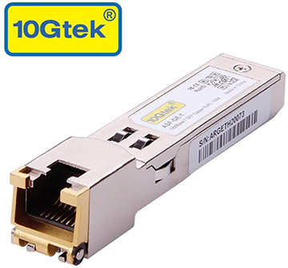

6. In order for the Compute Modules to boot up, you will need MicroSD cards to store the Operating System. For this, I went with the **Sandisk Ultra 32GB** MicroSD Card. *bulkmemorycards* has these for really cheap when you buy in bulk. I would recommend buying 4050 so you have 18 spares in case of failure and minimal downtime. You find them [here](https://bulkmemorycards.com/shop/microsd-cards/microsd-32gb/sd-32gb-class-10/32gb-microsd-ultra-sandisk-memory-card-2/).

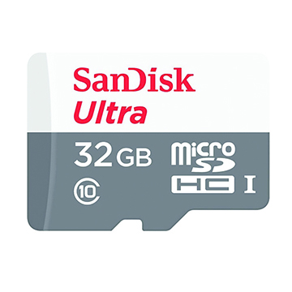

7. This next item is mainly for convenience. It is a **MicroSD to SD card adapter**. SD cards are much easier to handle in my opinion. They are really cheap anyway, so it is worth it for me. Maybe you don't care. This is *NOT* required. If you get them in bulk, they cost 0.40 USD each. They don't usually fail, so you only need to buy 160, which is enough so that you can fill up the ports on the **BalenaEtcher Pro**. This totals out to 64 USD. These can be found [here](https://bulkmemorycards.com/shop/accessories/adapters/micro-sd-to-sd-adapter/).

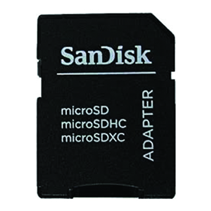

8. The next product gives power to all the Raspberry Pis. It is an **FSP 300W Flex ATX 80+ Gold PSU**. This is a unit that is mainly used in SFF PC builds, but works perfectly in this application. It has a very small footprint and is less than 1U tall, which is a *MUST* if the computing density is to be kept up. This will send power to 4 Turing Pis at any given time. It costs roughly 90 USD excl. Sales Tax and you will need 70 of them bringing your total for this item to roughly 6300 USD excl. Sales Tax and maybe shipping. This can be found [here](https://www.newegg.com/fsp-group-flexguru-300w-fsp300-50fgbbi/p/1HU-0095-000H4?Description=Flex%20ATX&cm_re=Flex_ATX-_-9SIABP99PM9855-_-Product&quicklink=true).

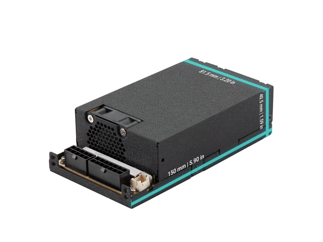

9. This is also in the Power Supply category, but it's not a power supply. These are **8-pin EPS cable splitters**. If you want to connect more than one Turing Pi per power supply, then this is a *MUST*. An 8-pin EPS connector can safely send up to 235 Watts safely. This is *WAY* above the 160 Watt MAX limit for 4 Turing Pis. You will need 210 of these total. This will cost you a whopping 2517.5 USD excl. Sales Tax. This can be found [here](https://www.amazon.com/Splitter-TeamProfitcom-Motherboard-Y-Splitter-Extension/dp/B07W9H9GNF#customerReviews).

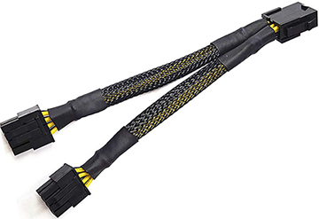

10. This next product is also *VERY* crucial. In order to have the power supply turn on without a motherboard switch or front panel connectors, we need a **PSU Jumper Cable**. This inexpensive, but genious little gadgets automatically shorts the connection simulating a physical button. Now, every time the power supply receives power, it will automatically turn on. To turn off the psu, cut off the power to it. You will need 140 of these jumpers total costing you 693 USD at 4.95 each. Again, overpriced for what it is, but I didn't find any in bulk. You could do this manually with a paperclip, but you could get shocked by the paperclip and it's not as appealing in my opinion. Check out the product [here](https://www.amazon.com/XSPC-ATX-Bridge-Tool-Black/dp/B00NKQ4F98/ref=sr_1_16?dchild=1&keywords=24-Pin+ATX+EPS+PSU+Power+Supply+Jumper+Bridge&qid=1590431050&refinements=p_36%3A-500&rnid=386442011&s=electronics&sr=1-16#customerReviews).

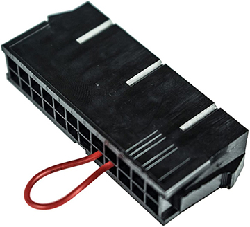

11. Now we get to cooling. Since we have 2016 Compute Modules per rack and we have some excess heat from other components like the PSU and the Turing Pi due to inefficiencies, we need some serious fan and heatsinks to get rid of all that heat. This is where the **Noctua NF-A14 iPPC-3000 PWM** fans come in. They are 140mm size fans and they spin at 3000 RPM, which translates to a lot of airflow and static air pressure. We will need 16 of these total, with 8 in each rack, in aa 4-top-4-bottom configuration. This creates an airflow path of top to bottom, which is great for convection. These fans can be checked out [here](https://www.amazon.com/dp/B00KFCRF1A?tag=noctua0b-20).

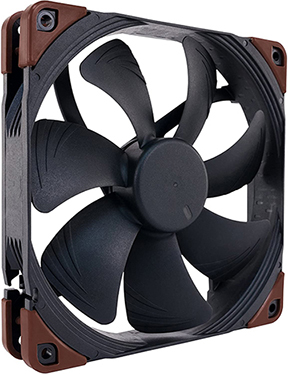

12. I'm going to put the following two products into one, because they will power the fans. The first product is the **Zalman ZM-MC1** Multi-fan connector cable. Only the 12 volt connections will be used (black). You will need four of these  costing you a total of 13.80 USD excl. Sales Tax and maybe shipping at 3.45 each. You can check it out [here](https://www.quietpcusa.com/Zalman-Fan-Multi-Connector-Cable-ZM-MC1-P157.aspx). This will provide the basis for the fan connectors. This next product splits the fan connectors so that you can connect more than two. This is the **Notcua NA-SYC1** dual fan y-cables. They split the fan cables into two. You will need four of these packs in order to get 8 fans per rack which will cost you 31.8 USD excl. Sales Tax and maybe shipping at 7.95 each. This product is found [here](https://www.quietpcusa.com/Noctua-Fan-Y-Cables-PWM-4-Pin-NA-SYC1-P1031.aspx). 

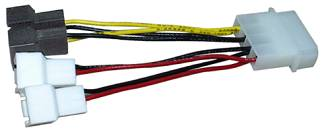 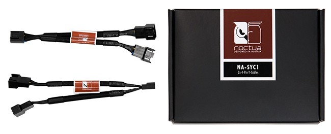

13. Last but not least, now that we have the cooling down, we need some way to get power to the Power Supplies. This is where these generic **Power Supply Cables** come in. You don't need anything special. You will need 70 of these cables bringing your total for this item to roughly 241.43 USD excl. Sales Tax. Prices may vary as you may need different sized cables. I went with 6 feet for the initial planning as that is the height of the rack. You may need longer or shorter cables depending on the layer number on the rack. I will update this section once that is figured out. This product is found [here](https://www.amazon.com/AmazonBasics-Power-Cord-6-Foot-Black/dp/B07RNLPXS7?ref_=s9_apbd_simh_hd_bw_b2VNE&pf_rd_r=224ZV1V67VMZ5R8CPGD8&pf_rd_p=92b5d6c2-449d-5f84-845e-5d3be79f8f69&pf_rd_s=merchandised-search-10&pf_rd_t=BROWSE&pf_rd_i=597260&th=1).

14. In order for everything to be connected to each other and to the internet, we will need **ethernet cables**. While using WiFi is doable, there will be a lot of interference with thousands of devices connecting to one or two bands. In this case, Ethernet is ideal. I am going to leave this up to you. Your cable length all depends on how much slack you want or where you will cable manage the cables. I will eventually get around to coming up with an example, but it is low priority as of now. This may or may not happen soon depending on when you are reading this.

15. Last, but certainly not least, we need the enclosure. This stores everything we need to run the server. In the case of the server space, this is called the server rack. For this build, I have chosen the **Tripp Lite SR42UBDP**. The extra depth of this model is perfect for this build. All the specs are nominal for this type of server. We will need two of these costing 3189.98 USD total at 1594.99 USD each. This is still expensive even for a high quality server rack, so if you find anything at comparable or better quality for a cheaper price, again, please let me know by posting an issue on this repo. You can buy the server rack [here](https://www.amazon.com/Tripp-Lite-Standard-Depth-Enclosure-SR42UB/dp/B003PC1EX2?th=1)

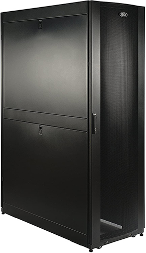

That about wraps it up for the part list. If you have any questions, feel free to open up an issue and make sure to check out the dimensions page to see how it all fits together!
