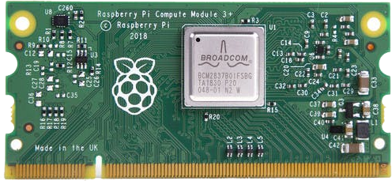

1. [Full Part List](part-list.md "Full Part List")
1. [Full Specifications](specs.md "Full Specifications")
1. [Full Dimensions, CAD Files, and Drawings](dimensions.md "Dimensions, 3D models, etc.")
1. [Backup Server](backup-server.md "Backup Server")
5. [Tips and Tricks to Save Time When Setting Up](save-time.md "Time-Saving Tips and Tricks")
---

**Full Specifications Below:**

* Main Computing Device: **Raspberry Pi Compute Module 3+**. Currently, the CM3+ is the latest version. As the Raspberry Pi Foundation comes out with newer versions, This guide will be updated accordingly.
  * CPU Cores per Compute Module: 4
  * CPU Core Configuration: 4x ARM Cortex-A53
  * CPU Base Frequency: 1.2 GHz
  * Supports Clock Frequency Boosting: No
  * Overclockable: Yes
  * Instruction Set: ARMv8-A 64-bit
  * Total Compute Modules in Cluster: 4032
  * Total CPU Cores in Cluster: 16128
  
**Here is what it looks like:**

  
* Mainboard: Turing Pi. This Mainboard holds 7 Raspberry Pi Compute Modules. It has rear IO for the master node in slot 1, GPIO Pins for every Compute Module, MicroSD Card slots for every Compute Module, and uses just one ethernet port to give ethernet to all the Compute Modules. They still get their own IP Address, so no worries there.
  * Number Needed for the whole cluster: 576
  * Power Consumption Per Mainboard: 40 Watts MAX 
  * Dimensions: 6.7 x 6.7 in.(120 x 120mm)(Length x Width). This is the size of a Mini-ITX Desktop-class motherboard.
  
**Here is what it looks like:**

**Software:**

* Operating System: **Raspbian Buster** *OR* **Ubuntu Server 20.04 LTS 64-bit**. For the CM3+, Raspbian is the best way to go, because it has only 1 GB of RAM and 64-bit Operating systems eat it up like crazy. If the CM4 or similar is available for purchase with 4GB of RAM, go with Ubuntu 20.04 LTS 64-bit. If Kubernetes doesn't support Ubuntu 20.04 LTS, then go with 18.04 LTS. This is the previous LTS version of Ubuntu that should be supported by Kubernetes. Ubuntu can be found [here](https://ubuntu.com/download/raspberry-pi) and Raspbian can be found [here](https://www.raspberrypi.org/downloads/raspbian/)

* Kubernetes: **K3s** by **Rancher Labs**. This is the most lightweight flavor of Kubernetes available for the Raspberry Pi at the time of writing while maintaining advanced configuration and HA, or High Availability with a variety of database and local storage options. *Ansible* will be used to remotely manage the cluster using a playbook to first setup kubernetes on all the nodes, and then doing remote commands to all the nodes.
